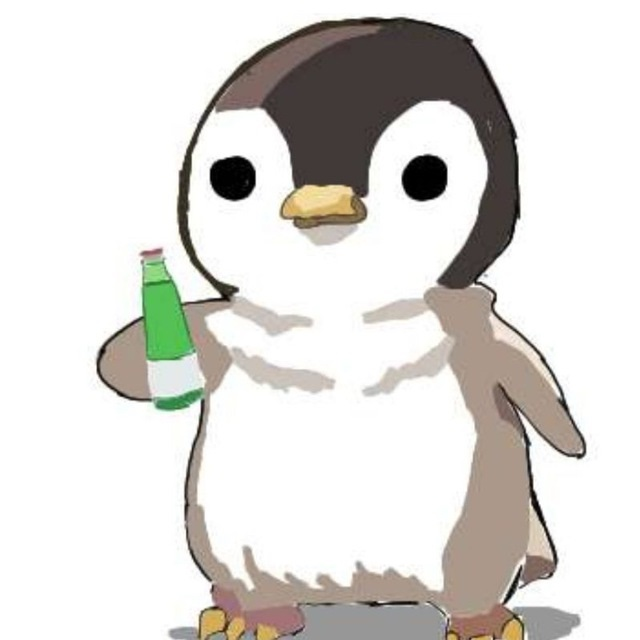

<h1 align="center">Hi 👋, I'm Yağız</h1>

<h3 align="center">A passionate Cyber Security Researcher.</h3>

- `whoami` Student at Kocaeli University and Cyber Security Associate Specialist at <a href="https://www.priviasecurity.com/en/">@Privia Security & PriviaHub</a>  

- `uptime` 19 years

- `pwd` İstanbul, Turkey

- `ps -a` Golang, WebAppSec, Malware Development

<h3 align="left">Connect with me:</h3>

	
	
	

<h3 align="left">Technologies I am familiar with:</h3>

		
        
		
		
		
		
				

<!--END_SECTION:waka-->
